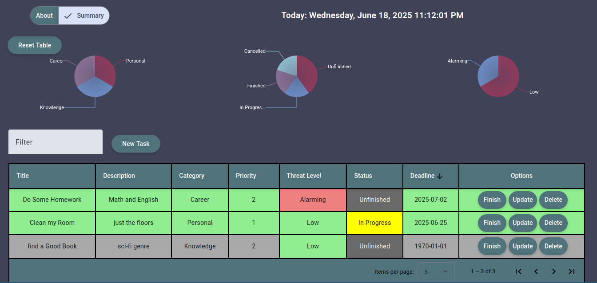

# TO-DO-APP

This is just a project to over-complicate the code under the hood of a Simple ToDolist app by adding a lot on the tech stack as well as adding some features.

## Current Features
- Usual CRUD functionalities of a To Do App
- Task/Row color changes depending on how near the deadline is
  - Green: More than 5 days bfore the deadline
  - Orange: Less than 5 days bfore the deadline
  - Red: Current day is deadline
  - Grey: Deadline has been passed
- Three Graphs showing current summary of tasks. Click on a slice to filter via that condition
  - Grouped by Category
  - Grouped by Task Status
  - Grouped by 'Threat Level' (how urgent as task is)

## Other things to over complicate
see this [To Do Textfile](https://github.com/AngeloRafael02/ToDoApp/blob/master/Docs/Documents/ToDo.txt)

## Current Stack / Used Packages
FrontEnd
- Angular 18
- Angular Material
- SCSS
- ngx-markdown
- ngx-charts

API
- REST API

Backend
- NestJS
- TypeORM
- Postgres
